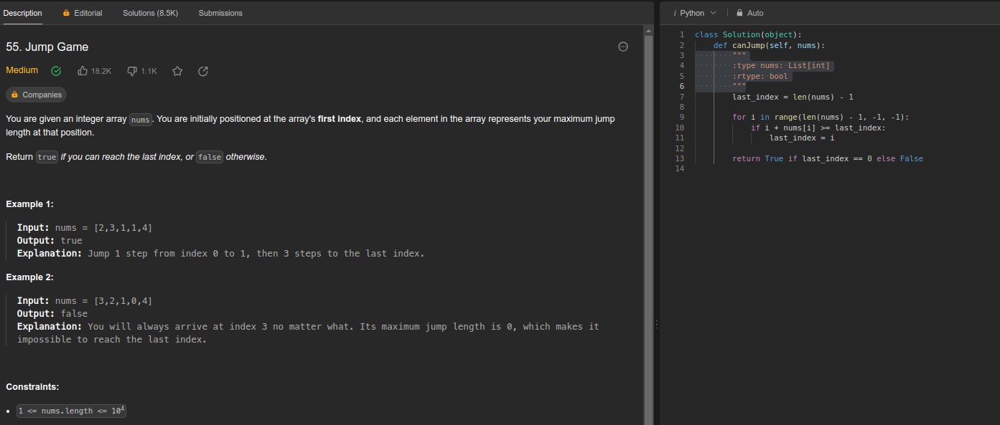

# **Greed_ExerciciosOnline**

**Número da Lista**: 3 
**Conteúdo da Disciplina**: Greed 

## Alunos
|Matrícula | Aluno |
| -- | -- |
| 20/0049020  |  Gabriel Barbosa |
| 21/1031708  |  Geovane Freitas |

## Sobre 
Neste projeto, iremos resolver exercícios do site [LeetCode](https://leetcode.com/) que envolvem o uso de algoritmos ambiciosos. 

## [Link da Apresentação]()

## Screenshots

## Exercício 1 - JumpGame

Dificuldade: Médio  
Link: [JumpGame](https://leetcode.com/problems/jump-game/description/)

Exercício que está relacionando com a teoria de algoritmos ambiciosos, foi feito para uma boa fixação do conteúdo estudado em sala. Para melhor explicação do exemplo e soluçaõ, veja o vídeo.

## Exercício 2 - Non-overlapping Intervals

Dificuldade: Médio  
Link: [Non-overlapping Intervals](https://leetcode.com/problems/non-overlapping-intervals/description/)

Exercício que envolve o uso de greed - interval scheduling e foi feito principalmente para fixação do conteúdo estudado em sala. Para melhor explicação do exemplo e soluçaõ, veja o vídeo.

## Exercício 3 - 

Dificuldade: Médio  
Link: [JumpGame](https://leetcode.com/problems/jump-game/description/)

## Exercício 4 - Course Schedule III
Dificuldade: Difícil  
Link: [Course Schedule III](https://leetcode.com/problems/course-schedule-iii/description/)

## Instalação 
**Linguagem**: Python 

Caso queira rodar localmente é necessário ter o python instalado.

## Uso 
Para verificar o funcionamento basta abrir o link do exercicio e copiar o código referente a questão, e logo após realizar o envio. Caso queira verificar localmente, é necessário adicionar a chamada da função principal com seus devidos paramêtros. para rodar basta utilizar o seguinte comando no terminal:

`python3 NomeDoArquivo.py`

